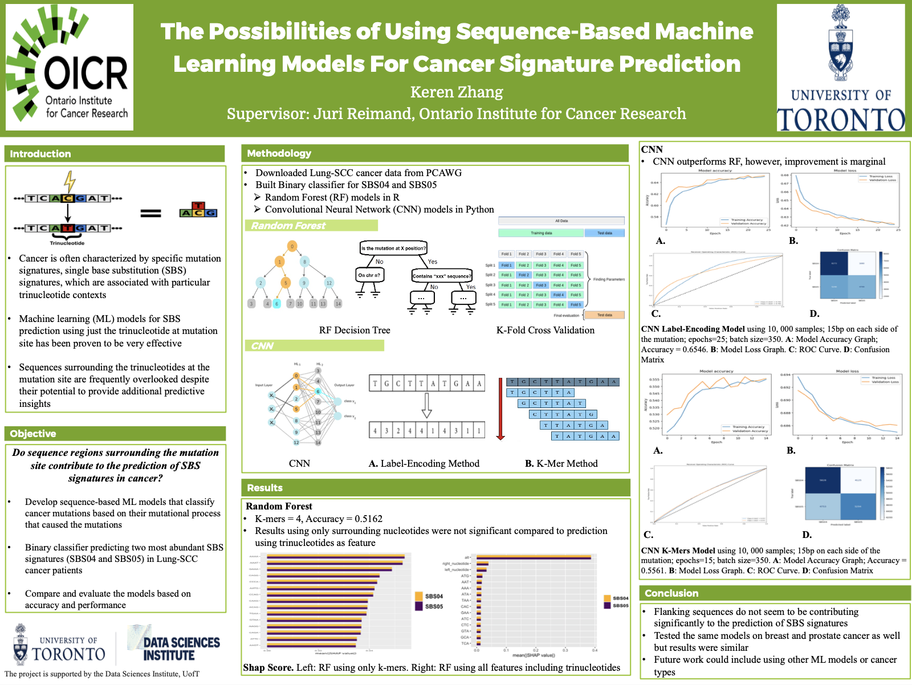

# sequence_based_SBS_prediction_model

Keren Zhang - SUDS Summer 2024

### The Possibilities of Using Sequence-Based Machine Learning Models For Cancer Signature Prediction

Cancer is often characterized by specific mutation signatures, known as single base substitution (SBS) signatures, which are associated with particular trinucleotide contexts. Traditional approaches to understanding these signatures have predominantly focused on the trinucleotide context encompassing the mutation site itself. However, the sequences flanking the mutation site are frequently overlooked despite their potential to provide additional predictive insights. 

### Goal
The object of this is to develop sequence-base machine learning models that classify mutation signature based on the surrounding nucleotides. 

### Data

The data is downloaded from PCAWG, and could be accessed on the cluster: 
```/.mounts/labs/reimandlab/private/users/k2zhang/share/PCAWG```

muts: mutation folder  
sig: SBS signature folder  
pcawg_primary_type.csv: csv containing the patient id and correpsonding cancer type  

To extract information for a specific type of cancer, for example lung cancer, the shell script in the ```data``` folder (```extract_lung_scc_cancer_data.sh```) could be used. 

### Src
The project code can be found in the ```src``` folder. 

Two different methods of ML were used for comparison, and are placed in different folders under ```src```:   ```random_forest``` and Convolutional Neural Network (```CNN```).   
The random forest model utilized a k-mer approach; the CNN model implemented both the k-mer approach and the label-encoding (one-hot) method. 

### Research Poster


